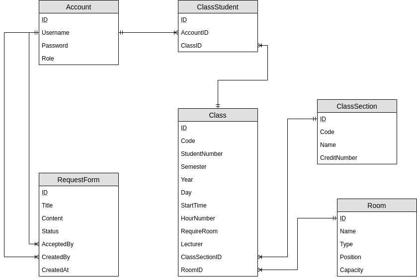

# Mục Lục
1. [Phần 1: Tổng quan về phần mềm](#introduction)
    1. [Công nghệ sử dụng](#tech-used)
2. [Phần 2: Mô tả chức năng có trong phần mềm](#paragraph1)
    1. [Các Actors](#list-actors)
    2. [Bảng chức năng](#function-table)
    3. [Mô hình Cơ sở dữ liệu](#er-model)
    4. [Mô hình nghiệp vụ] (#business-model)
    5. [Phác thảo giao diện](#project-img)    

## Phần 1: Tổng Quan 
Hiện nay, do nhu cầu quản lý và sắp xếp lịch trình ngày càng cần thiết trong cuộc sống. Việc lên lịch giúp mọi người có thể quản lý, sắp xếp công việc một cách hợp lý, đúng quy trình. Nhất là trong môi trường có tính tổ chức cao như trường học, công sở. Nhằm phục vụ nhu cầu đó, nhóm đã phát triển phần mềm “quản lý sắp xếp và cho mượn phòng học”. Phần mềm có tác dụng giúp đỡ trường học trong khâu quản lý và sắp xếp phòng học nhằm phục vụ mục đích học tập, giao lưu và sinh hoạt lớp của sinh viên. Phần mềm của nhóm gồm có hai phần: Sắp xếp phòng học theo lịch học và danh sách kèm theo thông tin phòng học có sẵn và xử lý các đơn yêu cầu mượn phòng học của sinh viên.

### Công nghệ sử dụng 
- Server backend: Nodejs + express framework
- Database: Postgres
- App Frontend: Reactjs

## Phần 2: Mô tả chức năng 
Phần mềm “quản lý sắp xếp và cho mượn phòng học” của nhóm gồm có các chức năng được mô tả trong bảng sau:

### Các Actors 
| STT | Actor         | Viết tắt | Mô tả                                      |
|-----|---------------|----------|--------------------------------------------|
| 1   | Sinh viên     | SV       | Sinh viên thuộc quản lý của trường đại học |
| 2   | Giảng viên    | GV       | Giảng viên dạy học trong trường            |
| 3   | Nhân viên PĐT | NV       | Nhân viên Phòng đào tạo                    |

### Bảng chức năng 
| STT | Danh mục                  | Mã                                        | Tên                             | Actor                                                      | Mô tả                                                                                                    |
|-----|---------------------------|-------------------------------------------|---------------------------------|------------------------------------------------------------|----------------------------------------------------------------------------------------------------------|
| 1   | Quản lý phòng học         | Fn001                                     | Thêm danh sách phòng học        | NV                                                         | Thêm vào hệ thống danh sách các phòng học mới                                                            |
| 2   | | Fn002                     | Thêm một phòng học                        | NV                              | Thêm vào một phòng học mới trong hệ thống                  |
| 3   | | Fn003                     | Sửa thông tin phòng học                   | NV                              | Thay đổi thông tin của một phòng học trong hệ thống        |
| 4   | | Fn004                     | Xóa phòng học                             | NV                              | Xóa một phòng học khỏi hệ thống                            |
| 5   | | Fn005                     | Xem danh sách phòng học                   | NV, SV, GV                      | Lấy ra xem danh sách các phòng học                         |
| 6   | | Fn006                     | Tìm kiếm phòng học                        | NV, SV, GV                      | Tìm kiếm phòng học                                         |
| 7   | | Fn007                     | Xem thông tin một phòng học theo mã phòng | NV, SV, GV                      | Lấy ra thông tin của một phòng học                         |
| 8   | Quản lý lớp môn học       | Fn008                                     | Thêm danh sách các lớp môn học  | NV                                                         | Thêm danh sách các lớp môn học                                                                           |
| 9   | | Fn009                     | Thêm một lớp môn học                      | NV                              | Thêm mới một lớp môn học                                   |
| 10  | | Fn010                     | Sửa thông tin lớp môn học                 | NV                              | Sửa đổi thông tin của mộ lớp môn học                       |
| 11  | | Fn011                     | Xóa lớp môn học                           | NV                              | Xóa một lớp môn học khỏi hệ thống                          |
| 12  | | Fn012                     | Xem danh sách lớp môn học                 | NV, SV, GV                      | Xem danh sách các lớp môn học                              |
| 13  | | Fn013                     | Tìm kiếm lớp môn học                      | NV, SV, GV                      | Tìm kiếm lớp môn học                                       |
| 14  | | Fn014                     | Xem thông tin một lớp môn học             | NV, SV, GV                      | Xem thông tin một lớp môn học                              |
| 15  | Quản lý lớp học phần      | Fn015                                     | Thêm danh sách các lớp học phần | NV                                                         | Thêm danh sách các lớp học phần vào hệ thống                                                             |
| 16  | | Fn016                     | Thêm một lớp học phần                     | NV                              | Thêm một lớp học phần vào hệ thống                         |
| 17  | | Fn017                     | Sửa thông tin lớp học phần                | NV                              | Sửa đổi thông tin của một lớp học phần                     |
| 18  | | Fn018                     | Xóa lớp học phần                          | NV                              | Xóa lớp học phần khỏi hệ thống                             |
| 19  | | Fn019                     | Xem danh sách lớp học phần                | NV, SV, GV                      | Xem danh sách các lớp học phần                             |
| 20  | | Fn020                     | Tìm kiếm lớp học phần                     | NV, SV, GV                      | Tìm kiếm lớp học phần                                      |
| 21  | | Fn021                     | Xem thông tin một lớp học phần            | NV, SV, GV                      | Xem thôn tin của một lớp học phần                          |
| 22  | Quản lý tài khoản         | Fn022                                     | Thêm danh sách tài khoản        | NV                                                         | Thêm vào hệ thống danh sách tài khoản sinh viên, giảng viên                                              |
| 23  | | Fn023                     | Thêm mới một tài khoản                    | NV                              | Thêm mới một tài khoản                                     |
| 24  | | Fn024                     | Sửa đổi một tài khoản                     | NV                              | Sửa đổi thông tin của tài khoản                            |
| 25  | | Fn025                     | Xóa tài khoản                             | NV                              | Xóa tài khoản đã tồn tại trong hệ thống                    |
| 26  | | Fn026                     | Xem danh sách tài khoản                   | NV                              | Xem danh sách tài khoản có trong hệ thống                  |
| 27  | | Fn027                     | Tìm kiếm tài khoản                        | NV                              | Tìm kiếm tài khoản                                         |
| 28  | | Fn028                     | Xem thông tin một tài khoản               | NV                              | Xem thông tin một tài khoản trong hệ thống                 |
| 29  | Nhóm chức năng lịch học   | Fn029                                     | Xếp lịch học                    | NV                                                         | Tạo mới một lịch học cho một kỳ học, việc xếp lịch được tự động hóa từ các thông tin phòng, lớp học phần |
| 30  | | Fn030                     | Sửa đổi lịch học                          | NV                              | Xếp thủ công, sửa đổi một số chi tiết trong lịch học đã có |
| 31  | | Fn031                     | Xem lịch học                              | SV                              | Xem lịch học của bản thân một sinh viên                    |
| 32  | | Fn032                     | Xem lịch dạy học                          | GV                              | Xem lịch dạy học của giảng viên                            |
| 33  | Nhóm chức năng mượn phòng | Fn033                                     | Gửi yêu cầu mượn phòng          | SV                                                         | Sinh viên tạo đơn mượn phòng và gửi yêu cầu tới nhân viên phòng đào tạo                                  |
| 34  | | Fn034                     | Xem danh sách các đơn mượn phòng          | NV, SV                          | Xem danh sách các đơn mượn phòng theo đối tượng người dùng |
| 35  | | Fn035                     | Xem một yêu cầu mượn phòng                | NV, SV                          | Xem nội dung của đơn mượn phòng                            |
| 36  | | Fn036                     | Phê duyệt yêu cầu mượn phòng              | NV                              | Phê duyệt yêu cầu mượn phòng                               |
| 37  | | Fn037                     | Hủy đơn mượn phòng                        | NV, SV                          | Hủy yêu cầu mượn phòng                                     |

### Mô hình Cơ sở dữ liệu 

### Mô hình ngiệp vụ

Mượn phòng:
- Bước 1: sinh viên đăng nhập vào hệ thống
- Bước 2: sinh viên tạo đơn mượn phòng, điền đầy đủ các thông tin: mục đích , loại phòng, sĩ số , thời gian
- Bước 3: gửi đơn để hệ thống xếp phòng và gửi yêu cầu cho nhân viên phòng đào tạo  
- Bước 4: nhân viên phòng đào tạo thực hiện chấp nhận đơn
- Bước 5: hệ thống gửi lại thông báo cho sinh viên gửi yêu cầu, cập nhật lại tình trạng phòng 

Sinh viên hủy đơn yêu cầu:
- Bước 1: sinh viên đăng nhập vào hệ thống
- Bước 2: xem danh sách các yêu cầu đã tạo
- Bước 3: thực hiện hủy đơn( đơn đó trong tình trạng đang chờ duyệt)

Nhân viên phòng đào tạo hủy đơn yêu cầu:
- Bước 1: sinh viên đăng nhập vào hệ thống
- Bước 2: sinh viên tạo đơn mượn phòng, điền đầy đủ các thông tin: mục đích , loại phòng, sĩ số , thời gian
- Bước 3: gửi đơn để hệ thống xếp phòng và gửi yêu cầu cho nhân viên phòng đào tạo  
- Bước 4: nhân viên phòng đào tạo thực hiện hủy đơn
- Bước 5: hệ thống gửi lại thông báo cho sinh viên gửi yêu cầu

### Phác thảo giao diện 

