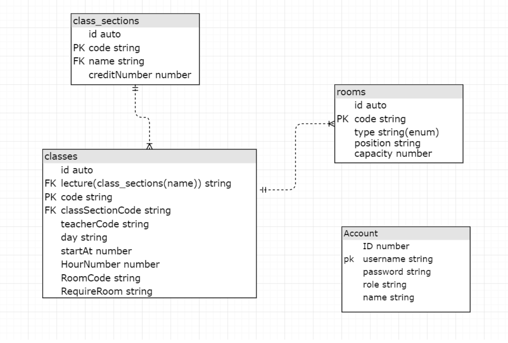
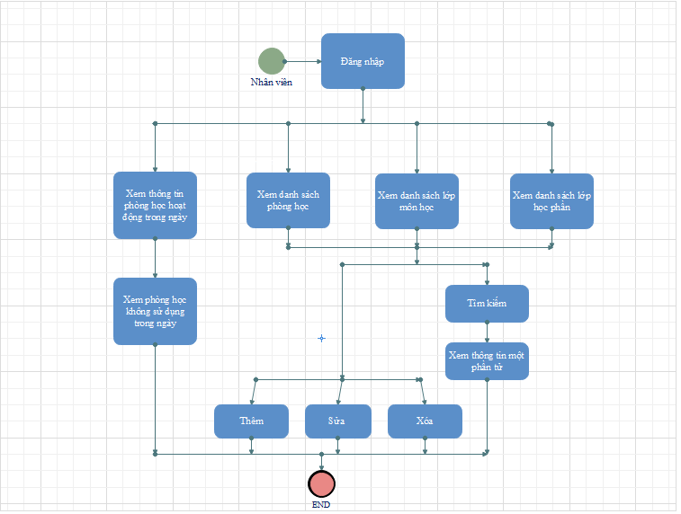

# Mục Lục
1. [Phần 1: Tổng quan về phần mềm](#introduction)
    1. [Công nghệ sử dụng](#tech-used)
    2. [Hướng dẫn cài đặt và sử dụng] (#setupUse)
2. [Phần 2: Mô tả chức năng có trong phần mềm](#paragraph1)
    1. [Các Actors](#list-actors)
    2. [Bảng chức năng](#function-table)
    3. [Mô hình Cơ sở dữ liệu](#er-model)
    4. [Mô hình nghiệp vụ] (#business-model)
    5. [Phác thảo giao diện](#project-img)    

## Phần 1: Tổng Quan 
Hiện nay, do nhu cầu quản lý và sắp xếp lịch trình ngày càng cần thiết trong cuộc sống. Việc lên lịch giúp mọi người có thể quản lý, sắp xếp công việc một cách hợp lý, đúng quy trình. Nhất là trong môi trường có tính tổ chức cao như trường học, công sở. Nhằm phục vụ nhu cầu đó, nhóm đã phát triển phần mềm “quản lý phòng học”. Phần mềm có tác dụng giúp đỡ trường học trong khâu quản lý phòng học. Phần mềm của nhóm gồm có hai phần: Sắp xếp phòng học theo lịch học và danh sách kèm theo thông tin phòng học có sẵn.

### Công nghệ sử dụng 
- Server backend: Nodejs + express framework
- Database: Postgres
- App Frontend: Reactjs, Redux, Material UI, Bootstrap

### Hướng dẫn cài đặt và Sử dụng 
- Khởi tạo một Database trống tại postgres của bạn. Sau đó chỉnh sửa thông tin về database, tài khoản, mật khẩu của postgres tại int3306_11/server-be/config/database.mjs
-  Khởi chạy server tại int3306_11/server-be: Sử dụng câu lệnh yarn để cài đặt toàn bộ package và yarn start để khởi chạy server. Server khởi chạy tại localhost:5555
- Kiểm tra postgres, ta thấy trong ứng dụng xuất hiện 4 bảng trống. Ta lấy dữ liệu trong file documents/data.txt và thực hiện câu lệnh query dữ liệu để insert data vào trong các bảng.
- Khởi động web app tại int3306_11/webapp: Sử dụng câu lệnh yarn để cài đặt toàn bộ package và yarn start để khởi chạy client. Client khởi chạy tại localhost:3000
- Ta cần đăng nhập tài khoản để sử dụng. VD: username: root pass: abc123

Phần mềm “quản lý phòng học” của nhóm gồm có các chức năng được mô tả trong bảng sau:

### Các Actors 
| STT | Actor         | Viết tắt | Mô tả                                      |
|-----|---------------|----------|--------------------------------------------|
|  1  | Nhân viên PĐT | NV       | Nhân viên Phòng đào tạo                    |

### Bảng chức năng 
| STT | Danh mục                  | Mã                                        | Tên                             | Actor                                                      | Mô tả                                                                                                    |
|-----|---------------------------|-------------------------------------------|---------------------------------|------------------------------------------------------------|----------------------------------------------------------------------------------------------------------|
| 1   | Quản lý phòng học         | Fn001                                     | Thêm danh sách phòng học        | NV                                                         | Thêm vào hệ thống danh sách các phòng học mới                                                            |
| 2   | | Fn002                     | Thêm một phòng học                        | NV                              | Thêm vào một phòng học mới trong hệ thống                  |
| 3   | | Fn003                     | Sửa thông tin phòng học                   | NV                              | Thay đổi thông tin của một phòng học trong hệ thống        |
| 4   | | Fn004                     | Xóa phòng học                             | NV                              | Xóa một phòng học khỏi hệ thống                            |
| 5   | | Fn005                     | Xem danh sách phòng học                   | NV                              | Lấy ra xem danh sách các phòng học                         |
| 6   | | Fn006                     | Tìm kiếm phòng học                        | NV                              | Tìm kiếm phòng học                                         |
| 7   | | Fn007                     | Xem thông tin một phòng học theo mã phòng | NV                              | Lấy ra thông tin của một phòng học                         |
| 8   | | Fn008                     | Xem phòng học hoạt động trong ngày        | NV                              | Xem thông tin của các lớp học phần học hoạt động trong ngày  |
| 9   | | Fn009                     | Xem phòng học không sử dụng trong ngày    | NV                              | Xem thông tin phòng học không sử dụng trong ngày             |
| 10  | Quản lý lớp môn học       | Fn010                                     | Thêm danh sách các lớp môn học  | NV                                                         | Thêm danh sách các lớp môn học                                                                           |
| 11  | | Fn011                     | Thêm một lớp môn học                      | NV                              | Thêm mới một lớp môn học                                   |
| 12  | | Fn012                     | Sửa thông tin lớp môn học                 | NV                              | Sửa đổi thông tin của mộ lớp môn học                       |
| 13  | | Fn013                     | Xóa lớp môn học                           | NV                              | Xóa một lớp môn học khỏi hệ thống                          |
| 14  | | Fn014                     | Xem danh sách lớp môn học                 | NV                              | Xem danh sách các lớp môn học                              |
| 15  | | Fn015                     | Tìm kiếm lớp môn học                      | NV                              | Tìm kiếm lớp môn học                                       |
| 16  | | Fn016                     | Xem thông tin một lớp môn học             | NV                              | Xem thông tin một lớp môn học                              |
| 17  | Quản lý lớp học phần      | Fn017                                     | Thêm danh sách các lớp học phần | NV                                                         | Thêm danh sách các lớp học phần vào hệ thống                                                             |
| 18  | | Fn018                     | Thêm một lớp học phần                     | NV                              | Thêm một lớp học phần vào hệ thống                         |
| 19  | | Fn019                     | Sửa thông tin lớp học phần                | NV                              | Sửa đổi thông tin của một lớp học phần                     |
| 20  | | Fn020                     | Xóa lớp học phần                          | NV                              | Xóa lớp học phần khỏi hệ thống                             |
| 21  | | Fn021                     | Xem danh sách lớp học phần                | NV                              | Xem danh sách các lớp học phần                             |
| 22  | | Fn022                     | Tìm kiếm lớp học phần                     | NV                              | Tìm kiếm lớp học phần                                      |
| 23  | | Fn023                     | Xem thông tin một lớp học phần            | NV                              | Xem thông tin của một lớp học phần                          |

### Mô hình Cơ sở dữ liệu 

### Mô hình ngiệp vụ

### Phác thảo giao diện 

